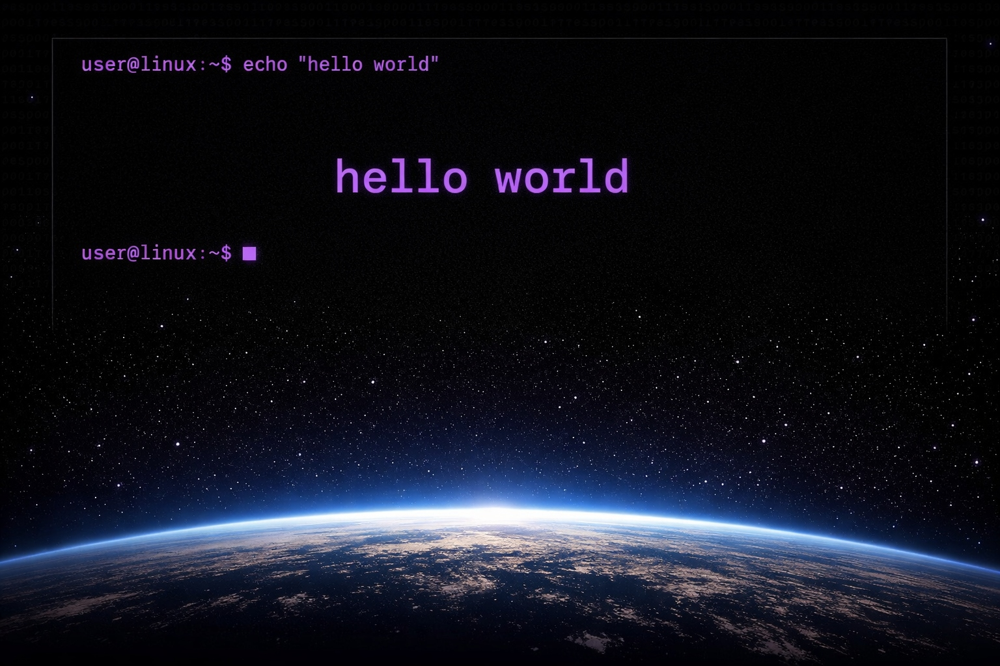

# Well Hello
<div align="center">


[](https://ianburwell.github.io)


[](https://github.com/IanBurwell/IanBurwell.github.io/actions/workflows/deploy.yml)
</div>

Welcome to my website's source! It isn't anything special and I am no web dev, but feel free to poke around.

## Usage
Install pnpm and run
```bash
pnpm install 
pnpm run dev
```

## Credits
My website is based on the astro theme [Spectre](https://github.com/louisescher/spectre) by Louis Escher, kudos to him!

<details>
<summary>TODO</summary>

- Move over old projects from previous website
- Add back giscus support
- Potentially add website size to the readme somehow. It would be cool to flex how small it is PLUS having it there would make me try and push it to be even more light weight